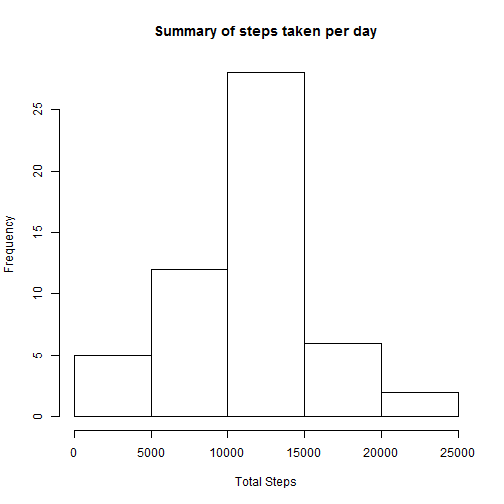
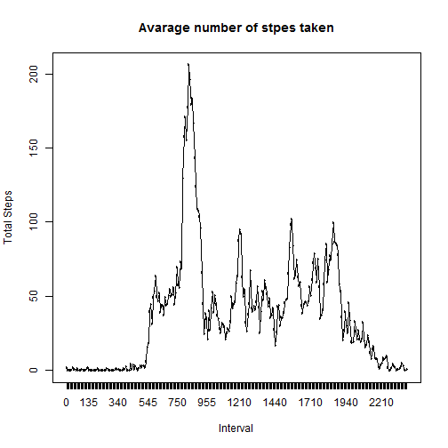
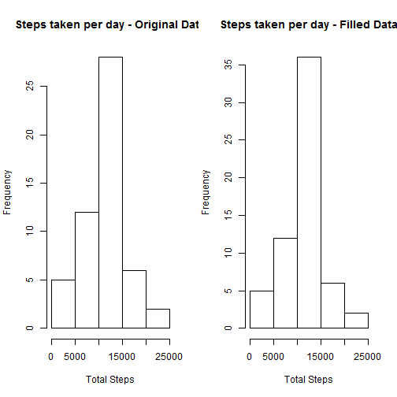
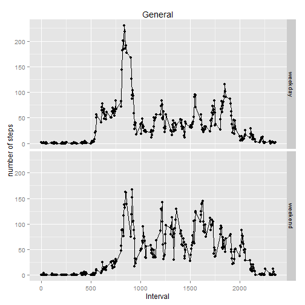

## Loading and preprocessing the data

### Assumptions
This solution assumes the data file is already downloaded in your working directory and does not validate if it exists or not
 
For plotting and data manipulation it uses qggplo2 and dplyr. Those libraries should exists in your R installation


```r
# read data file
activity <- read.csv("activity.csv")
```

```
## Warning in file(file, "rt"): cannot open file 'activity.csv': No such file
## or directory
```

```
## Error in file(file, "rt"): cannot open the connection
```

```r
library(dplyr)
library(ggplot2)
```


## 1.What is mean total number of steps taken per day?

First, calculate the total number of steps taken per day using "summarize" function from dplyr
Note that I calculate Total, Mean and Median of stpes in the same command (mean and median are not required but I used them for preliminary analysis)

Second, generate an histogram of the total number of steps taken by day

Lastly, calculate mean and median of the TOTAL number of stpes taken


```r
# sumarize and calculate total stpes taken by day
su.activity <- summarise(group_by(activity, date), tot = sum(steps), mean = mean(steps), median = median(steps))

# generate histogram
hist(su.activity$tot, 
     xlab='Total Steps', main="Summary of steps taken per day")
```

 

```r
# calculate and report mean and median of TOTAL stpes taken per day
one.mean <- mean(su.activity$tot, na.rm = TRUE)
one.median <- median(su.activity$tot, na.rm = TRUE)
```
Mean is 1.0766189 &times; 10<sup>4</sup>, Median is `one.median`.


## 2. What is the average daily activity pattern?

Make a time series plot (i.e. type = "l") of the 5-minute interval (x-axis) 
and the average number of steps taken, averaged across all days (y-axis).

Which 5-minute interval, on average across all the days in the dataset, 
contains the maximum number of steps?

### Solution
First, generate a new data set with NA values omitted
Second, convert "interval" variable into factor for easy summarization and plotting
Third, summarize the dataset by interval and calculate Total, Mean and Median
Fourth, generate the plot


```r
# generate new data frame
activity2 <- na.omit(activity)
# convert interval into factor
activity2$interval <- as.factor(activity2$interval)
#calculate average by interval
su.activity2 <- summarise(group_by(activity2, interval), tot = sum(steps), mean = mean(steps), median = median(steps))
two.max <- max(su.activity2$mean)
#plot
plot(su.activity2$interval,su.activity2$mean,type = "n",
     ylab = "Total Steps", xlab = "Interval",
     main = "Avarage number of stpes taken") ## maximun is at 835 interval
lines(su.activity2$interval, su.activity2$mean, col = "black")
```

 

As the plot shows, the maximum average steps are at 8:35 interval, with 206.1698113 


## 3. Imputing missing values

Calculate and report the total number of missing values in the dataset.
Devise a strategy for filling in all of the missing values in the dataset.
Create a new dataset that is equal to the original dataset but with the missing 
data filled in.
Make a histogram of the total number of steps taken each day and Calculate
and report the mean and median total number of steps taken per day.
Do these values differ from the estimates from the first part of the assignment?
What is the impact of imputing missing data on the estimates of the total daily 
number of steps?

### Solution 
Fisrt, calculate the number of missing values
Second, the strategy selected is to asign the mean of the TOTAL intervals to the missing values. To accomplish this, I merge the sumarized datasets of points 1 and 2 above by date
Third, create a new dtataset with the filled values.this is accomplished usinf a "for"" cycle
forth, sumarize the new filled values by date and calulate total, mean and median
fifth, generate a side by side histogram to visually note the diferences of original and filled datasets


```r
# calculate total number of missing values
missing <- is.na(activity$steps)
sum(missing)
```

```
## [1] 2304
```

```r
# strategy= asign mean of activity by interval and create a new datataset 
# first join the original activity dataframe with the summary in point 1 by "activity"
activity3 <- merge(activity, su.activity2, by.x="interval", by.y="interval")
#sort by date and interval
activity3 <- arrange(activity3, date, interval)
# now replace NA by the mean of that day
for (i in 1:nrow(activity3)) {
        if (is.na(activity3[i,2])) {
                activity3[i,2] <- activity3[i,5]
        }
}
# sumarize and calculate total stpes taken by day
su.activity3 <- summarise(group_by(activity3, date), tot = sum(steps), mean = mean(steps), median = median(steps))
# generate histogram
par(mfrow = c(1,2))
hist(su.activity$tot,
     xlab='Total Steps', main="Steps taken per day - Original Data")
hist(su.activity3$tot,
     xlab='Total Steps', main="Steps taken per day - Filled Data")
```

 

```r
# calculate and report mean and median of TOTAL stpes taken per day
third.mean <- mean(su.activity3$tot, na.rm = TRUE)
third.median <- median(su.activity3$tot, na.rm = TRUE)
```

Mean and median of original dataset are 1.0766189 &times; 10<sup>4</sup> and `one.median` respectively
Mean and median of filled dataset are 1.0766189 &times; 10<sup>4</sup> and `third.median` respectively

There are not significan diferences between original and filled datasets mean and median values with the chosen filled strategy


## 4. Are there differences in activity patterns between weekdays and weekends?
Use the dataset with the filled-in missing values for this part.

Create a new factor variable in the dataset with two levels - "weekday"
and "weekend" indicating whether a given date is a weekday or weekend day.

Make a panel plot containing a time series plot (i.e. type = "l") of the
5-minute interval (x-axis) and the average number of steps taken, averaged
across all weekday days or weekend days (y-axis). 

### Solution

First, calculate the day of the week by using a temp colum in the dataset
second, create a new column "day" determine that coantains "weekday" or "weekend"
Third, in a new dataframe, sumarize by new column "day" and interval, calulating Total stpes and mean of steps  
fourth, genearate a panle plot showing the behaviour in weekdays and weenends


```r
## add a temp column with dates in new format
activity3$d.week <- as.POSIXlt(activity3$date,format="%Y-%m-%d") 
activity3$day <- weekdays(activity3$d.week)  ## generates "day name"
#calculate weekday
for (i in 1:nrow(activity3)) {
        if (activity3[i,8] %in% c('Saturday','Sunday')) {
                activity3[i,8] <- "weekend"
        } else {
                activity3[i,8] <- "weekday"
        }
}

#new dataframe eliminating unnecesary columns
activity4 <- select(activity3, -d.week, -tot, -mean, -median)
activity4$day <- as.factor(activity4$day)
# summarize new dataset
su.activity4 <- summarise(group_by(activity4, day, interval), tot = sum(steps), mean = mean(steps), median = median(steps))

## generate plot using qqplot2
qplot(interval, mean, data=su.activity4, facets = day ~ .
      , geom = c("line", "point")
      , main="General"
      , xlab = "Interval"
      , ylab = "number of steps")
```

 

Overall, thereare less stpes in the weekends, as per plot
